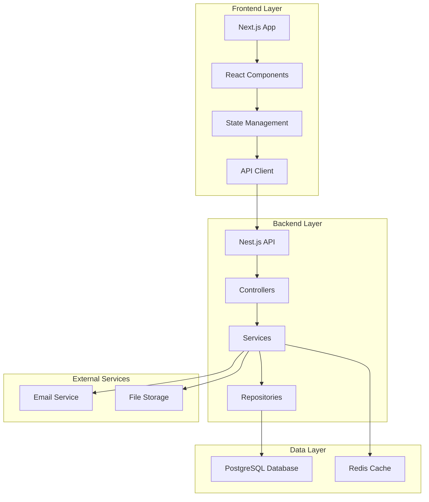

# Design Document

## Overview

ManageX is designed as a modern, scalable management application following microservices principles with a clear separation between frontend and backend. The architecture leverages Nest.js for a robust, enterprise-grade backend API and Next.js for a performant, SEO-friendly frontend with server-side rendering capabilities.

The system follows RESTful API design principles with JWT-based authentication, role-based access control (RBAC), and real-time updates through WebSocket connections. The frontend implements a component-based architecture with responsive design using Tailwind CSS.

## Architecture

### High-Level Architecture



### Technology Stack

**Backend:**
- Nest.js with TypeScript
- PostgreSQL for primary data storage
- Redis for caching and session management
- JWT for authentication
- Passport.js for authentication strategies
- TypeORM for database operations
- WebSocket for real-time features

**Frontend:**
- Next.js 15 with React 19
- TypeScript for type safety
- Tailwind CSS for styling
- React Query for server state management
- Zustand for client state management
- React Hook Form for form handling
- Chart.js for data visualization

## Components and Interfaces

### Backend Components

#### Authentication Module
- **AuthController**: Handles login, registration, logout endpoints
- **AuthService**: Manages JWT token generation, validation, and user authentication
- **JwtStrategy**: Passport strategy for JWT token validation
- **AuthGuard**: Protects routes requiring authentication

#### User Management Module
- **UserController**: CRUD operations for user management
- **UserService**: Business logic for user operations
- **UserRepository**: Data access layer for user entities
- **RoleGuard**: Implements role-based access control

#### Project Management Module
- **ProjectController**: Project CRUD operations and project-specific endpoints
- **ProjectService**: Project business logic, progress calculations
- **ProjectRepository**: Data access for project entities
- **ProjectGateway**: WebSocket gateway for real-time project updates

#### Task Management Module
- **TaskController**: Task CRUD operations and task assignment
- **TaskService**: Task business logic, status management, notifications
- **TaskRepository**: Data access for task entities

#### Dashboard Module
- **DashboardController**: Analytics and reporting endpoints
- **DashboardService**: Data aggregation and report generation
- **ReportService**: PDF/CSV export functionality

### Frontend Components

#### Layout Components
- **AppLayout**: Main application wrapper with navigation
- **Sidebar**: Navigation menu with role-based visibility
- **Header**: Top navigation with user menu and notifications
- **Breadcrumbs**: Navigation path indicator

#### Authentication Components
- **LoginForm**: User authentication interface
- **RegisterForm**: New user registration
- **ProtectedRoute**: Route wrapper for authenticated pages

#### Project Management Components
- **ProjectList**: Grid/list view of projects with filtering
- **ProjectCard**: Individual project display component
- **ProjectForm**: Create/edit project modal
- **ProjectDetail**: Detailed project view with tasks

#### Task Management Components
- **TaskBoard**: Kanban-style task board
- **TaskCard**: Individual task display
- **TaskForm**: Create/edit task modal
- **TaskAssignment**: User assignment interface

#### Dashboard Components
- **DashboardOverview**: Main dashboard with key metrics
- **ProjectChart**: Project progress visualization
- **TaskChart**: Task completion analytics
- **UserActivityChart**: Team productivity metrics

## Data Models

### User Entity
```typescript
interface User {
  id: string;
  email: string;
  password: string; // hashed
  firstName: string;
  lastName: string;
  role: UserRole;
  isActive: boolean;
  createdAt: Date;
  updatedAt: Date;
  projects: Project[];
  assignedTasks: Task[];
}

enum UserRole {
  ADMIN = 'admin',
  MANAGER = 'manager',
  MEMBER = 'member'
}
```

### Project Entity
```typescript
interface Project {
  id: string;
  name: string;
  description: string;
  startDate: Date;
  endDate: Date;
  status: ProjectStatus;
  progress: number; // calculated field
  createdBy: User;
  members: User[];
  tasks: Task[];
  createdAt: Date;
  updatedAt: Date;
}

enum ProjectStatus {
  PLANNING = 'planning',
  IN_PROGRESS = 'in_progress',
  ON_HOLD = 'on_hold',
  COMPLETED = 'completed',
  CANCELLED = 'cancelled'
}
```

### Task Entity
```typescript
interface Task {
  id: string;
  title: string;
  description: string;
  status: TaskStatus;
  priority: TaskPriority;
  dueDate: Date;
  project: Project;
  assignee: User;
  createdBy: User;
  estimatedHours: number;
  actualHours: number;
  createdAt: Date;
  updatedAt: Date;
}

enum TaskStatus {
  TODO = 'todo',
  IN_PROGRESS = 'in_progress',
  IN_REVIEW = 'in_review',
  DONE = 'done'
}

enum TaskPriority {
  LOW = 'low',
  MEDIUM = 'medium',
  HIGH = 'high',
  URGENT = 'urgent'
}
```

## Error Handling

### Backend Error Handling
- **Global Exception Filter**: Catches and formats all unhandled exceptions
- **Validation Pipes**: Automatic request validation with detailed error messages
- **HTTP Exception Filters**: Standardized error responses with proper status codes
- **Logging Service**: Comprehensive error logging with context information

### Frontend Error Handling
- **Error Boundaries**: React error boundaries for component-level error catching
- **API Error Interceptor**: Centralized API error handling with user-friendly messages
- **Form Validation**: Real-time form validation with field-level error display
- **Toast Notifications**: User feedback for success/error states

### Error Response Format
```typescript
interface ErrorResponse {
  statusCode: number;
  message: string | string[];
  error: string;
  timestamp: string;
  path: string;
}
```

## Testing Strategy

### Backend Testing
- **Unit Tests**: Jest-based testing for services and utilities
- **Integration Tests**: End-to-end API testing with test database
- **Controller Tests**: HTTP endpoint testing with mocked services
- **Repository Tests**: Database operation testing with test fixtures

### Frontend Testing
- **Component Tests**: React Testing Library for component behavior
- **Integration Tests**: User flow testing with mock API responses
- **E2E Tests**: Playwright for full application workflow testing
- **Visual Regression Tests**: Screenshot comparison for UI consistency

### Test Coverage Goals
- Backend: Minimum 80% code coverage
- Frontend: Minimum 70% code coverage for critical components
- E2E: Coverage of all major user workflows

### Testing Environment
- Separate test database with automated seeding
- Mock external services (email, file storage)
- Automated testing in CI/CD pipeline
- Performance testing for API endpoints

## Security Considerations

### Authentication & Authorization
- JWT tokens with refresh token rotation
- Password hashing using bcrypt with salt rounds
- Role-based access control (RBAC) implementation
- Session management with Redis

### Data Protection
- Input validation and sanitization
- SQL injection prevention through TypeORM
- XSS protection with content security policies
- CORS configuration for cross-origin requests

### API Security
- Rate limiting to prevent abuse
- Request size limits
- API versioning for backward compatibility
- Audit logging for sensitive operations